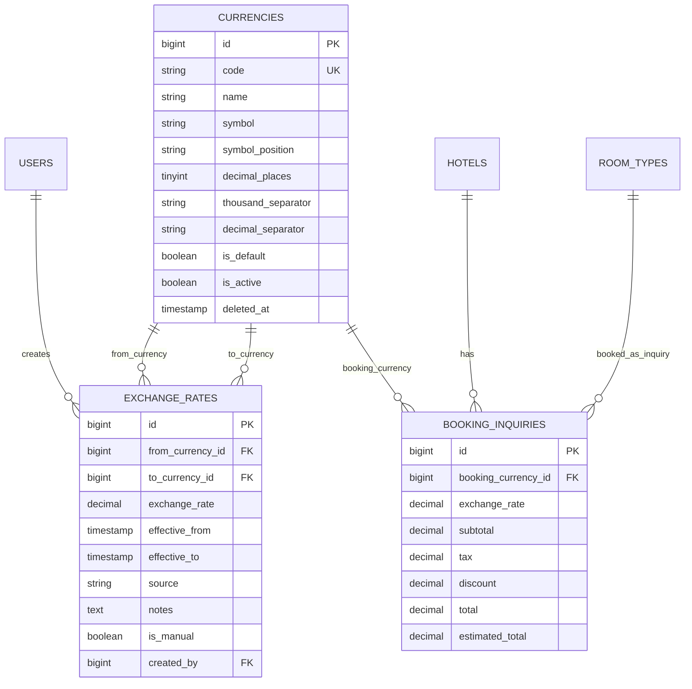

# Multi-Currency Architecture

## Design Decisions

- Currency is master data, not a text field. `currencies` owns ISO code, display rules, default/base currency status, and activation state so bookings, payments, invoices, reporting, and accounting can share one reference.
- Exchange rates are append-only history. `exchange_rates.exchange_rate`, pair, and `effective_from` are immutable through the API; corrections are new rows so historical bookings and payments remain auditable.
- Financial records snapshot their currency and exchange rate. `booking_inquiries` now has nullable snapshot columns as a non-breaking bridge. Future booking/payment/invoice tables should use the same pattern and never recalculate old records with newer rates.
- Conversion and formatting live in services. Controllers validate HTTP input and delegate conversion, historical lookup, cross-rate calculation, rounding, and formatting to `CurrencyService` and `ExchangeRateService`.
- Soft delete is limited to currency master data. A currency with financial history is deactivated instead of deleted. Exchange rates cannot be deleted through the API.

## ER Diagram

## Relationships

- `Currency hasMany ExchangeRate` as `fromExchangeRates`.
- `Currency hasMany ExchangeRate` as `toExchangeRates`.
- `ExchangeRate belongsTo Currency` as `fromCurrency`.
- `ExchangeRate belongsTo Currency` as `toCurrency`.
- `ExchangeRate belongsTo User` as `creator`.
- `BookingInquiry belongsTo Currency` as `bookingCurrency`.

## Services

- `CurrencyService`
  - Converts amounts using latest or historical rates.
  - Formats money with symbol placement, precision, thousands separator, decimal separator, and Arabic digit/separator output.
  - Validates ISO 4217 codes through Symfony Intl when available.
  - Rounds by currency decimal precision using Brick Math when available.
- `ExchangeRateService`
  - Finds latest and historical rates.
  - Calculates inverse and cross rates through the configured default currency.
  - Validates active currency pairs.
  - Leaves room for Stripe, PayPal, MyFatoorah, HyperPay, Moyasar, ERPNext, Odoo, bank APIs, and rate-provider integrations.

## API Endpoints

- Public/read-safe:
  - `GET /api/currencies/`
  - `GET /api/currencies/{id}/`
- Admin only:
  - `GET /api/admin/finance/currencies/`
  - `POST /api/admin/finance/currencies/`
  - `GET /api/admin/finance/currencies/{id}/`
  - `PATCH /api/admin/finance/currencies/{id}/`
  - `DELETE /api/admin/finance/currencies/{id}/`
  - `GET /api/admin/finance/exchange-rates/`
  - `POST /api/admin/finance/exchange-rates/`
  - `GET /api/admin/finance/exchange-rates/{id}/`
  - `PATCH /api/admin/finance/exchange-rates/{id}/`
  - `DELETE /api/admin/finance/exchange-rates/{id}/` returns `422` because rates are append-only.

## Filtering, Search, Sorting, Pagination

- Currencies: `is_active`, `is_default`, `search`, `sort`, `direction`, `page_size`.
- Exchange rates: `from_currency_id`, `to_currency_id`, `source`, `is_manual`, `effective_at`, `search`, `sort`, `direction`, `page_size`.
- Controllers eager-load related currencies and creators for exchange rates.

## Validation Rules

- Currency `code`: required on create, unique, uppercase `^[A-Z]{3}$`, ISO 4217 compliant.
- Currency default: one default currency; changing a default clears the previous default.
- Default currency cannot be deactivated or deleted.
- Exchange rate: `gt:0`.
- Exchange-rate pair: currencies must be active and different.
- Duplicate active rate prevention: unique pair and `effective_from`.
- Exchange-rate value, pair, and effective date are immutable after creation.

## Seeder Summary

`CurrencySeeder` seeds:

`USD`, `EUR`, `GBP`, `SAR`, `AED`, `QAR`, `KWD`, `OMR`, `BHD`, `JOD`, `EGP`, `TRY`, `YER`, `INR`, `PKR`, `CNY`, `JPY`, `CHF`, `AUD`, `CAD`.

`USD` is the default/base currency.

## Future Extensions

- Add final `bookings`, `payments`, `invoices`, `refunds`, `taxes`, and `ledger_entries` tables with currency snapshot columns:
  - Transaction currency ID.
  - Base currency ID.
  - Exchange rate used.
  - Original amount.
  - Base amount.
  - Provider reference and provider currency when applicable.
- Store gateway payload IDs separately from accounting records for Stripe, PayPal, MyFatoorah, HyperPay, Moyasar, and banking APIs.
- Add scheduled exchange-rate imports into `exchange_rates` without updating existing rows.
- Add rate-source trust levels and approval workflow before automated rates become usable.
- Add materialized reporting tables for base-currency dashboards once volume grows.
- Use accounting-period locks before invoices/payments become immutable ledger entries.
